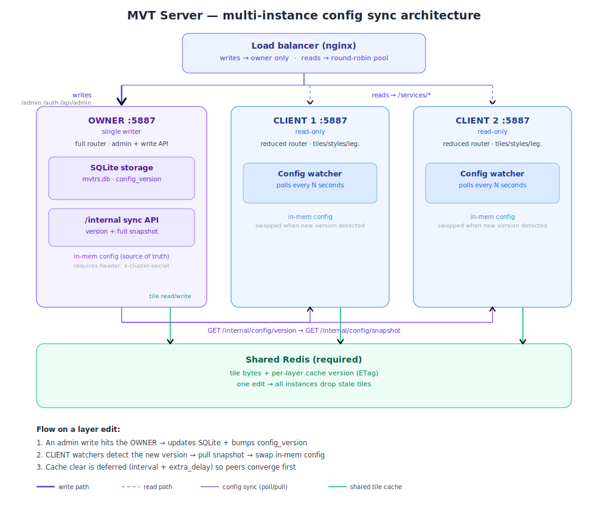
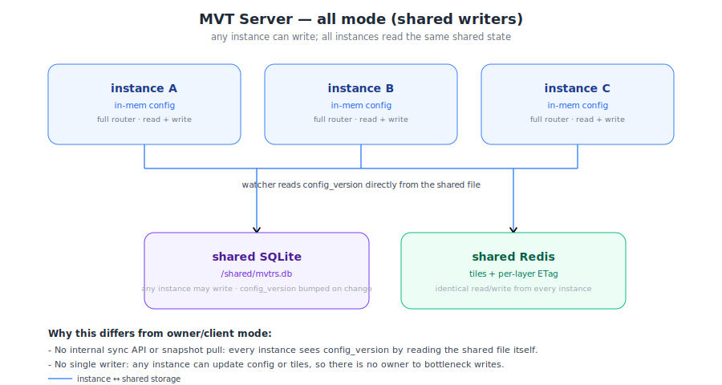

# MVT-RS Clustering / Multi-Instance

MVT-RS can run as a single process (the default) or as a cluster of instances behind
a load balancer. This document explains when and how to use the clustering feature,
covering both deployment situations and the relevant security requirements.

## Overview

Each MVT-RS instance holds the full application config — catalog layers, categories,
users, groups, and styles — in memory. A write (e.g. editing a layer in the admin
panel) updates the SQLite config database and refreshes the in-memory state of the
instance that handled the request.

**The problem:** when two or more instances run behind a load balancer, a write on
one instance leaves the others stale. Clients routed to a stale instance see the old
config until that instance restarts or is manually updated.

**The solution:** the cluster sync feature adds a lightweight background watcher on
every non-owner instance. It polls for a config version counter and, when a change
is detected, fetches and applies a full config snapshot — keeping all instances
consistent within one polling interval.

Two deployment situations are supported:

| Situation | Topology | Mode to use |
|---|---|---|
| Same host, shared volume | All instances on one machine sharing a single SQLite file | `shared` |
| Different hosts | Owner instance exposes an HTTP sync API; clients pull from it | `owner` + `client` |

### Topology — owner / client (different hosts)



### Topology — shared (same host, shared volume)



---

## Shared cache requirement

Any non-standalone mode **requires a shared Redis tile cache** (`database.redis_url`),
and all instances must point at the same Redis. Startup fails otherwise. This is what
makes config changes propagate to tiles: the tile bytes and the per-layer cache
version (used for the ETag) both live in Redis, so when one instance invalidates a
layer, every instance immediately sees the cleared tiles and the new ETag. With a
per-host disk cache each instance would have an isolated cache and peers would serve
stale tiles indefinitely.

**Invalidation timing.** Editing a layer bumps the config version right away, so peers
start reloading the new config within their watch interval. The actual cache clear is
**deferred** by `config_watch_interval_secs + cache_invalidation_extra_delay_secs`
(owner/shared modes). Clearing only after peers have converged prevents a lagging
instance from regenerating — and re-caching — a tile from the old config in the
window between the edit and the reload.

---

## Situation 1 — Same host (shared volume)

All instances run on the same machine and mount the same directory containing
`mvtrs.db`. All instances must open the same SQLite file via a shared filesystem path
(a shared volume) — typically same-host jails or containers, because SQLite over a
network filesystem (NFS) is unreliable. The watcher reads the version counter directly
from the shared SQLite file; no network call is needed.

### Configuration

Set `mode: shared` on every instance and point them all at the same SQLite file:

```yaml
# All instances use the same config
database:
  sqlite_path: "/shared/data/mvtrs.db"
  redis_url: "redis://shared-redis:6379"   # required: all instances share this cache

cluster:
  mode: "shared"
  config_watch_interval_secs: 10   # check for changes every 10 s
```

Or via environment variables:

```bash
MVT_DATABASE__SQLITE_PATH=/shared/data/mvtrs.db
MVT_DATABASE__REDIS_URL=redis://shared-redis:6379
MVT_CLUSTER__MODE=shared
MVT_CLUSTER__CONFIG_WATCH_INTERVAL_SECS=10
```

### Notes

- Any instance can receive admin writes; the watcher on the others detects the bump
  and refreshes within one interval.
- No `owner_url` or `shared_secret` is required in this mode.
- The propagation delay is at most `config_watch_interval_secs` seconds.

---

## Situation 2 — Different hosts (owner / client)

This is the cross-host model, analogous to a GeoServer master/slave setup. One
instance is designated the **owner**: it holds the SQLite database, serves the admin
panel, and exposes a private internal HTTP API that clients use to synchronize. Every
other instance is a **client**: it carries no local SQLite, loads its initial config
from the owner on startup, and refreshes on a polling interval thereafter.

### Owner configuration

```yaml
database:
  redis_url: "redis://shared-redis:6379"   # required: same Redis as every client

cluster:
  mode: "owner"
  config_watch_interval_secs: 10   # owner's own watcher is a no-op, but set for clarity
  cache_invalidation_extra_delay_secs: 5   # extra wait before clearing the shared cache
  shared_secret: "change-me-to-a-random-cluster-secret"
```

Environment variables:

```bash
MVT_DATABASE__REDIS_URL=redis://shared-redis:6379
MVT_CLUSTER__MODE=owner
MVT_CLUSTER__SHARED_SECRET=change-me-to-a-random-cluster-secret
```

### Client configuration

```yaml
database:
  redis_url: "redis://shared-redis:6379"   # required: same Redis as the owner

cluster:
  mode: "client"
  config_watch_interval_secs: 10
  owner_url: "https://owner-host:5887"
  shared_secret: "change-me-to-a-random-cluster-secret"
```

Environment variables:

```bash
MVT_DATABASE__REDIS_URL=redis://shared-redis:6379
MVT_CLUSTER__MODE=client
MVT_CLUSTER__CONFIG_WATCH_INTERVAL_SECS=10
MVT_CLUSTER__OWNER_URL=https://owner-host:5887
MVT_CLUSTER__SHARED_SECRET=change-me-to-a-random-cluster-secret
```

### Internal API endpoints

The owner exposes two endpoints under `/internal/config/`:

| Endpoint | Purpose |
|---|---|
| `GET /internal/config/version` | Returns the current config version counter |
| `GET /internal/config/snapshot` | Returns a full `ConfigSnapshot` (JSON) |

Both endpoints require the `x-cluster-secret` header to match `cluster.shared_secret`.
A missing or wrong secret returns `401 Unauthorized`. These endpoints are **only**
present when `mode = owner`; they are absent from standalone, shared, and client
instances.

### Reduced client router

Client instances mount a reduced router: tiles, styles, legends, assets, and the
health endpoint. The admin panel, write API (`/api/admin/...`), and `/internal` are
absent. Your load balancer must route write traffic exclusively to the owner (see
[Load balancer](#load-balancer-nginx) below).

---

## Load balancer (nginx)

```nginx
upstream mvt_owner {
    server owner-host:5887;
}

upstream mvt_tiles {
    server owner-host:5887;
    server client1-host:5887;
    server client2-host:5887;
}

server {
    listen 443 ssl;
    # ... ssl config ...

    # Admin panel + login + config write API => the owner (the only writer)
    location /admin     { proxy_pass http://mvt_owner; }
    location /auth      { proxy_pass http://mvt_owner; }
    location /api/admin { proxy_pass http://mvt_owner; }

    # Tile reads, styles, legends, and assets are all under /services/
    # and are served from memory by every instance => balanced pool
    location /services/ { proxy_pass http://mvt_tiles; }

    # Everything else (home page, health, static assets) => balanced pool
    location /          { proxy_pass http://mvt_tiles; }

    # /internal must NOT be routed publicly — omit it entirely
}
```

Key points:

- `/services/tiles/...`, `/services/styles/{name}`, `/services/legends/{name}`, and
  `/services/map_assets/...` are all under the `/services/` prefix and can be served
  by any instance (tiles from PostGIS, styles/legends from in-memory cache).
- `/admin`, `/auth`, and `/api/admin` must reach the owner only because it is the
  single writer.
- `/internal` must **never** appear in a public nginx `location` block. It is a
  server-to-server API only.

---

## Security

The `/internal/config/snapshot` response contains the full serialized config,
**including password hashes**. Treat it accordingly:

1. **Always protect with a strong `shared_secret`** (at least 16 random characters).
   Generate one with `openssl rand -hex 24`.
2. **Use TLS or a trusted private network** for all traffic between the owner and
   its clients. Never send the secret or the snapshot over plain HTTP on an
   untrusted network.
3. **Never expose `/internal` publicly.** There must be no nginx `location /internal`
   block; the path must be blocked at the load balancer or firewall.
4. The `x-cluster-secret` header is checked on every request to `/internal`. A
   missing or wrong value returns `401` immediately.

---

## Behavior & limits

| Aspect | Detail |
|---|---|
| Propagation delay | At most `config_watch_interval_secs` seconds |
| Single writer | Only the owner (or any instance in `shared` mode) can persist config changes |
| Client cold-start | A `client` instance retries until the owner is reachable; startup blocks until the first snapshot is applied |
| Owner down | Clients continue serving from their last in-memory snapshot but cannot pick up new config changes; new clients cannot cold-start |
| Shared cache required | Every non-standalone mode requires a shared Redis cache (`database.redis_url`); startup fails without it. All instances must point at the same Redis. |
| Tile-cache invalidation | Editing a layer clears that layer's tiles and bumps its cache version in the shared Redis, so all instances drop the stale tiles and clients get a new ETag. In `owner`/`shared` modes the clear is deferred by `config_watch_interval_secs + cache_invalidation_extra_delay_secs` so peers reload the new config before the cache is repopulated. |
| Backward compatibility | `mode: standalone` (the default) adds no watcher, no internal API, and uses the full router — identical to pre-clustering behaviour |

---

## Verification

The following two-instance smoke test verifies the end-to-end sync path:

1. Start the **owner** on port 5887:
   ```bash
   MVT_CLUSTER__MODE=owner \
   MVT_CLUSTER__SHARED_SECRET=test-secret-1234 \
   cargo run -- --config config/config.yaml
   ```

2. Start a **client** on port 5888:
   ```bash
   MVT_SERVER__PORT=5888 \
   MVT_CLUSTER__MODE=client \
   MVT_CLUSTER__OWNER_URL=http://localhost:5887 \
   MVT_CLUSTER__SHARED_SECRET=test-secret-1234 \
   MVT_CLUSTER__CONFIG_WATCH_INTERVAL_SECS=5 \
   cargo run -- --config config/config.yaml
   ```

3. On the **owner** admin panel (`http://localhost:5887/admin`), edit a layer and a
   style (save both).

4. Wait 5–10 seconds (one poll interval). Without restarting the client, request the
   same layer and style from the **client** via the public read endpoints:
   - Tile: `GET http://localhost:5888/services/tiles/<layer>/<z>/<x>/<y>.pbf`
   - Style: `GET http://localhost:5888/services/styles/<category:name>`
   (Note: clients have no admin panel, so `/api/catalog/layer` and `/api/admin/...`
   are unavailable; use only `/services/...` endpoints.) Both changes should be reflected.

5. Confirm the internal API is protected:
   ```bash
   # Without the secret → 401
   curl -i http://localhost:5887/internal/config/snapshot
   # HTTP/1.1 401 Unauthorized

   # With the correct secret → 200 + JSON snapshot
   curl -i -H "x-cluster-secret: test-secret-1234" \
        http://localhost:5887/internal/config/snapshot
   # HTTP/1.1 200 OK
   ```
